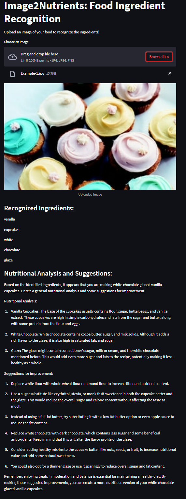
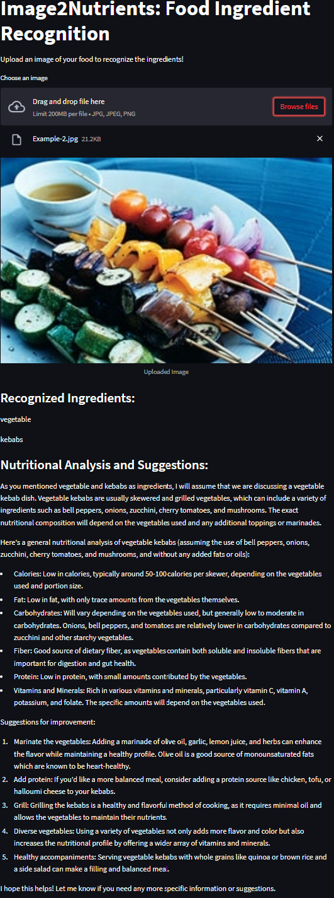
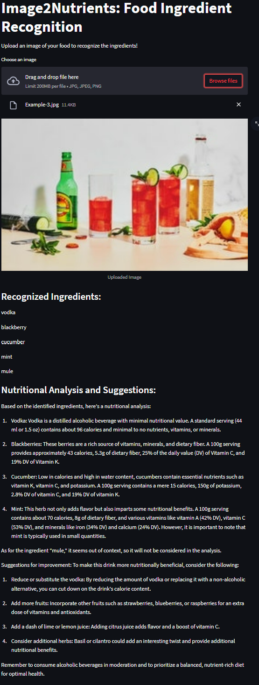
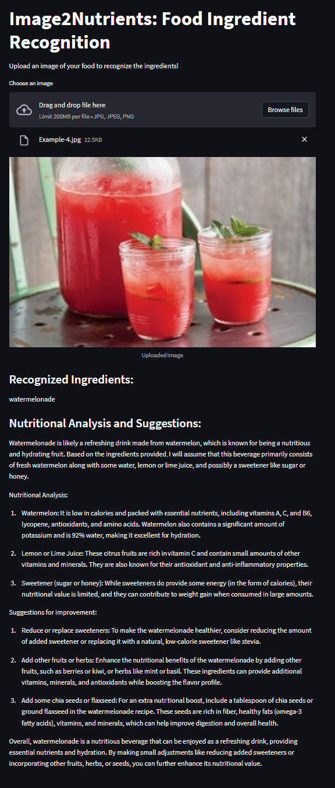
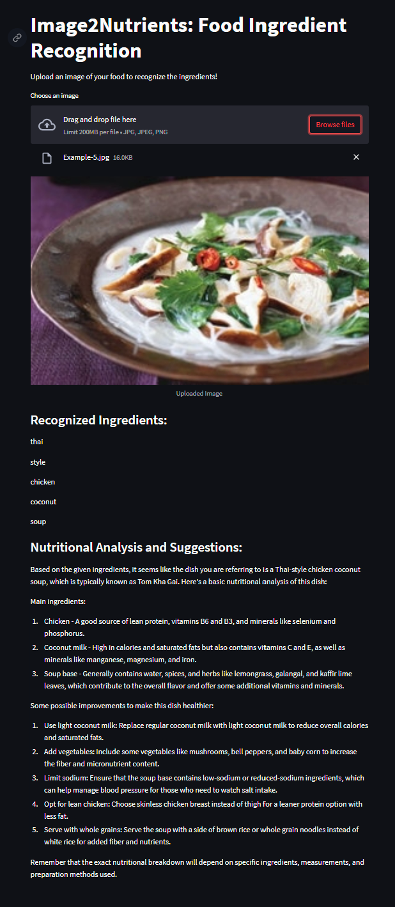

# ImageToCalories
ImageToCalories is an application developed with the aim to extract nutritional insights from images of food, with no additional information required. The application operates using artificial intelligence to analyze images of food, identify the ingredients present, and then provide a comprehensive nutritional breakdown. Here are the steps involved:

Fine-tuning the VisionEncoderDecoderModel: We started by fine-tuning a VisionEncoderDecoderModel, a pre-trained model, on a specific food dataset. The model was capable of interpreting food images and identifying key ingredients.

Feature Extraction and Tokenization: We utilized the Vision Transformer (ViT) and AutoTokenizer from the same pre-trained model ("nlpconnect/vit-gpt2-image-captioning") to handle the process of feature extraction and tokenization.

Dataset Preparation: We meticulously gathered, cleaned, and preprocessed a dataset of food images and their corresponding ingredients, which were stored in a CSV file. All images were ensured to be in the correct format and irrelevant entries were removed.

Model Training: Training the model was a complex process carried out on Google Colab Pro due to its high computational capacity. We ran batches of images and their corresponding captions (ingredient lists) from our dataset through the feature extractor and tokenizer. This transformed the images and text into a format that the model could understand. The inputs were then fed into the model, and the loss was computed. Adjusted the model parameters with backpropagation and gradient descent. Trained the model with 10 epochs.

Creating User Interface with Streamlit: Used Streamlit to design a user-friendly web interface for ImageToCalories. Users can upload images of their food and receive detailed nutritional information.

Looking ahead, the plan is to enhance the precision of our ingredient identification and nutritional analysis further. Our future plans include refining our model with additional data, introducing more nuanced parameters for analysis, and offering personalized dietary recommendations based on factors like age, gender, lifestyle, and health conditions. Our goal is to make ImageToCalories an essential tool for personalized nutrition, promoting healthier eating habits, and fostering a healthier society globally.

